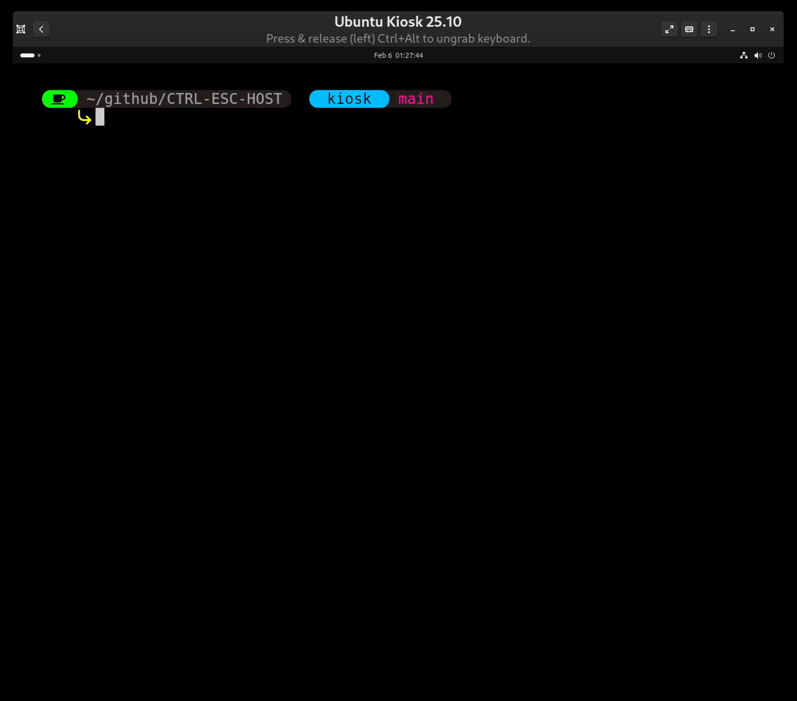

This section organizes Linux kiosk escape workflows from initial breakout to post-exploitation. Start with the initial tactics, then move into persistence and network pivoting.

## Video Walkthrough

Click the thumbnail to open the video in GitHub's file viewer (which will render a player).

## Contents

- `1 - Initial Escape Tactics/`: Initial breakout workflows and shared resources.
- `2 - Next Steps/`: Persistence, enumeration, and post-escape hygiene.
- `3 - Post-Exploitation - Moving from Kiosk to Domain and-or Network/`: Lateral movement and network objectives.
